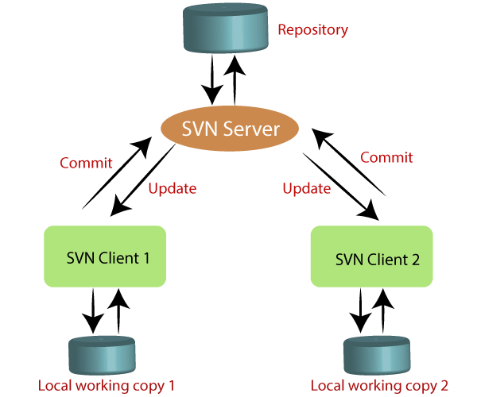

# svn

## svn 이란



## SVN 사용흐름

* 최초로 서버 소스를 checkout 한다
* 소스를 수정한다
* commit 할 파일을 add 한다
* update 를 통해서 저장소에 새로운 파일이 없는지 확인한다
* update 과정에서 conflict 가 일어나면 이를 해결한다(수정후, resolve 해주어야함)
* commit 을 해서 저장소에 파일을 등록한다

## add 버전관리에 파일 추가


## commit

* commit 명령을 수행할때는 반듯이 작업 내역을 작성 한다.


## 충돌 해결


### 원인 이해하기

충돌은 둘 이상의 개발자가 동일한 소스코드의 동일한 라인을 수정하고 저장소에 커밋하려 할 때 발생한다. 다음 예를 통해 왜 파일 충돌이 발생하는지 간단히 살펴보자. 아래 와 같이 최초에 저장소에 test.c 라는 파일이 있다고 하자.

```c
 void main() {
     printf(""); // 최초 소스코드 
 }
```

 개발자 A와 B가 저장소로부터 test.c 파일을 update 받는다.

먼저 개발자 A가 test.c 파일을 아래와 같이 수정한 다음 저장소에 다시 commit 한다. 정상적으로 Commit 된다.

```c
void main() {
     int i=0; // 개발자 A 수정 후 커밋 
     printf("");
}
```

그 후에 개발자 B는 저장소의 최신 커밋(개발자 A가 수정한 커밋)은 update 받지 않고, 개발자 A가 수정한 소스코드 라인과 동일 한 라인을 아래와 같이 수정하고 저장소에 commit 하려한다.

```c
 void main() {
     int abc=0; // 개발자 B 동일 라인 수정
     printf("");
 }
```

* 그러면 원격 저장소 커밋(Head)이 최신임으로 먼저 update를 받으라는 경고 문구가 아래와 같이 뜬다. 이제 개발자 A는 update를 받는다.


* 그러면 아래와 같이 충돌이 발생하고 commit이 실패한다.


* SVN 서버 프로그램의 입장에서는 동일한 라인에 두가지 내용이 있음으로 어떤 것을 선택해야 하는지 결정할 수가 없다.

### 충돌 시 생긴 파일의 의미

위와 같이 test.c 파일에 충돌이 발생하면 test.c 파일은 SVN에 의해 자동으로 아래와 같이 변경된다.

```c
 void main() {
 <<<<<<< .miine
     int abc=0;
 ||||||| .r[Base] (로컬 Base Revision 번호)
 =======
     int i=0;
 >>>>>>> .r[Head] (원격 저장소의 Head Revision 번호)
     printf("");
}
```

```"<<<<<< mine"``` 마크 부터 ```"========"``` 마크 사이의 코드는 로컬의 내가 수정한 파일의 내용이고
```"========"``` 마크 부터 ```">>>>>>> .r[Head]"``` 마크 사이의 코드는 저장소에 최종 본 파일의 내용이다.
위 두 코드가 충돌을 일으킨다는 의미이고 둘 중 하나를 선택하라는 의미이다.

그리고 test.c파일이 존재하는 경로에 추가적으로 test.c.mine / test.c.rOLDREV / test.c.rNEWREV 파일이 생성된 것을 확인할 수 있는데

* test.c.mine 파일은 로컬에 저장된 현재 커밋하려 했던 내 파일 내용을 담고 있고
* test.c.rOLDREV 파일은 내가 저장소로부터 내려 받았던 커밋 파일(Base 커밋) 즉 내가 수정하기 전의 원본 파일이
* test.c.rNEWREV 파일에는 현재 저장소에 저장된 최신 파일(Head 커밋) 내용을 담고 있다.


### 해결하기

```c
 void main() {
     int abc=0; // 최종 코드로 결정
     printf("");
}
```

1. 저장소 로그 기능을 이용해 해당 코드를 누가 최종 ```commit``` 했는지 확인하여 누구의 코드가 맞는지 확인 후 아래와 같이 최종 코드를 선택해 준다.  
2. SVN 팝업 메뉴에서 ```Resolve``` 메뉴를 실행한다. ```Resolve``` 메뉴를 실행한다고해서 ```test.c``` 파일이 수정되는 내용은 없다.
단지 충돌이 사용자에 의해 해결되었음을 SVN에 알리고 부가적으로 생성된 파일들이 제거되게 된다.
3. 이제 다시 ```Commit``` 하면 내 변경 사항이 저장소의 최신 버전(Head 커밋)이 되게 된다.  


