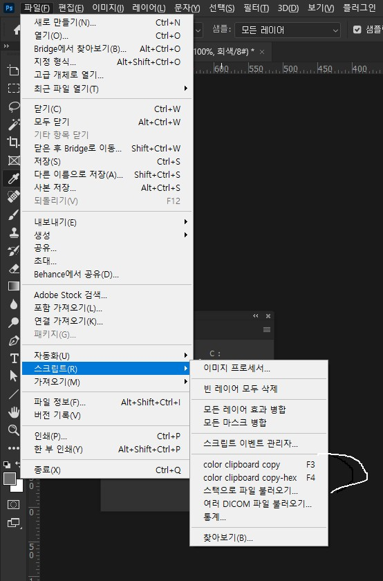

# 포토샵 스크립트

## 스크립트를 등록하고 단축키를 지정

스크립트를 다운로드 한 후 스크립트 폴더에 복사해야합니다.

PC에서 경로는 다음과 같습니다.

C:\Program Files\Adobe\Photoshop (CS or CS2 or whatever version you've got)\Presets\Scripts\
MAC에서 경로는 다음과 같습니다.

Applications> Photoshop (CS or CS2 or whatever version you've got)> Presets> Scripts.

이 폴더에 스크립트를 복사 한 후에는 file> script 메뉴에 스크립트가 나타나기 전에 Photoshop을 종료했다가 다시 시작해야합니다.

## 목록

* 