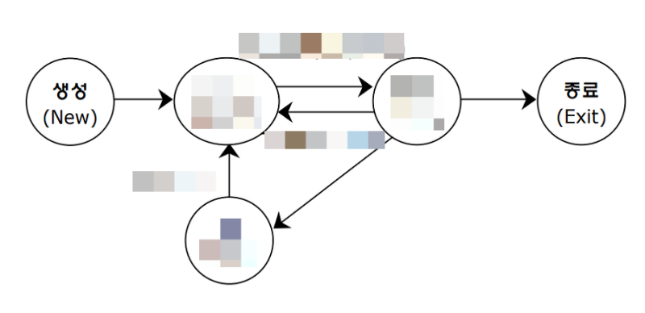

# <정보처리기사 실기 기출 모의고사 18>

## 일반 PC급 컴퓨터들로 가상화된 대형 스토리지를 형성하고, 다양한 소스를 통해 생성된 빅데이터를 효율적으로 저장하고 처리하는 오픈 소스 기반 분산 컴퓨팅 플랫폼 (16년 3회, 20년 4·5회 실기 기출)

* 하둡 (Hadoop)

--

* 1) 스니핑 / 2) 스누핑 / 3) 스푸핑 - [니누푸]

## 1) 네트워크 중간에서 자신이 아닌 남의 패킷 정보를 도청하는 해킹 기법의 하나이다. 주로 자신에게 와야할 정보가 아닌 정보를 자신이 받도록 조작하는 행위를 말한다. (20년 4·5회 실기 기출)

* 스니핑

## 2) '기웃거리다, 염탐하다'라는 뜻을 가진 단어로. 네트워크 상에 떠도는 중요 정보를 몰래 획득하는 행위

* 스누핑

## 3) 외부의 악의적 네트워크 침입자가 웹사이트를 구성해 사용자들을 속여 방문을 유도한 뒤, 인터넷 프로토콜인 TCP/IP의 구조적 결함을 이용해 사용자의 시스템 권한을 획득한 뒤 정보를 빼가는 해킹 수법

* 스푸핑

--

* 1) 기밀성 / 2) 무결성 / 3) 가용성 - [기무가]

## 1) 오직 인가(authorization)된 사용자만 정보 자산에 접근할 수 있는 것을 의미한다.


## 2) 정보 자산을 보호하기 위해 적절한 권한을 가진 사용자에 의해서 인가된 방법으로만 정보를 변경할 수 있도록 하는 것을 말한다.


## 3) 정보 자산에 대해 사용자가 필요로 하는 적절한 시간에 접근 가능한 것을 의미한다. (20년 4·5회 실기 기출)

## 테이블내의 데이터 중복성에 의해서 발생되는 데이터 불일치 현상을 일컫는 말

* 이상 현상 (Anomaly)

##

* 1) 삽입 이상 / 2) 삭제 이상 / 3) 갱신 이상 - [삽삭갱]

## 1) 정보 저장 시 해당정보의 불필요한 세부정보를 입력해야 하는 경우

(20년 4·5회 실기 기출)


## 2) 정보 삭제 시 원치 않는 다른 정보가 같이 삭제되는 경우

(20년 4·5회 실기 기출)


## 3) 중복 데이터 중에서 특정 부분만 수정되어 중복된 값이 모순을 일으키는 경우

(20년 4·5회 실기 기출)

## 1) 32비트 길이의 식별자로 0.0.0.0~255.255.255.255까지의 숫자의 조합으로 이루어지며 총 네구간으로 나눠져있으며 최대 12자리의 번호로 이루어져 있는 것

* IPv4

## 2) 기존 주소체계를 128비트 크기로 확장한 차세대 인터넷 프로토콜 주소로 16비트 단위로 나누어지며 각 16비트 블록은 다시 4자리 16진수로 변환되고 콜론으로 구분되어지는 것 (20년 4·5회 실기 기출)

* IPv6

출처: https://m.blog.naver.com/hostinggodo/220589113088

## IPv4 전송방식 : 유니캐스트, 멀티캐스트, ( ① )

* 브로드캐스트 : 유멀브

## IPv6 전송방식 : 유니캐스트, 멀티캐스트, ( ② )

* 애니캐스트 : 유멀애


## 1) 1960년대 AT&T 벨 연구소, MIT, General Electric이 공동 개발한 운영체제로, 대부분 C 언어로 작성되었으며 멀티유저와 멀티태스킹을 지원하고, 계층 구조의 파일 시스템을 갖는 운영체제 (20년 4·5회 실기 기출)

* 유닉스 (UNIX)

## 2) 1991년 리누스 토발즈(Linus Torvalds)가 (1:유닉스)을 기반으로 개발한 운영체제로, (1)과 완벽하게 호환되고 대부분의 특징이 (1)과 동일하며 프로그램 소스 코드가 무료로 공개되어 있는 운영체제

* 리눅스 (LINUX)

## 컴퓨터 네트워킹에서 쓰이는 용어로서, IP 패킷의 TCP/UDP 포트 숫자와 소스 및 목적지의 IP 주소 등을 재기록하면서 라우터를 통해 네트워크 트래픽을 주고 받는 기술을 말한다. (20년 4·5회 실기 기출)

* NAT (Network Address Translation)

## GoF(Gang of Fout) 디자인 패턴 3가지

* 생성패턴, 구조패턴, 행위패턴 - [생구행]

(20년 4·5회 실기 기출)




## 준비 상태(Ready List)에 있는 여러 프로세스 중 실행될 프로세스를 선정(Scheduling)하여 CPU를 할당하는 것으로 문맥교환이 발생하고, 프로세스는 준비 상태에서 실행 상태로 전이하는 프로세스 상태전이

* 디스패치 (Dispatch)

## 하나의 프로세스가 CPU를 사용 중인 상태에서 다른 프로세스가 CPU를 사용하도록 하기 위해, 이전의 프로세스의 상태(문맥)를 보관하고 새로운 프로세스의 상태를 적재하는 작업

* 문맥 교환 (Context Switch)

## 실행 상태에 있는 프로세스가 지정된 할당시간을 초과하기 전에, 입출력이나 기타 사건이 발생하여 CPU를 스스로 반납하고 입출력이 완료될 때까지 대기 상태가 되는 프로세스 상태전이

* 블록 (Block)

## CPU를 할당받아 실행되고 있는 프로세스는 지정된 할당시간이 초과되면 스케줄러에 의해 CPU 반납 후 다시 준비 상태가 되는 프로세스 상태전이

* 타이머 런 아웃 (Timer Run Out)

(20년 4·5회 실기 기출 - 프로세스 상태 전이도: 생성, (준비), (실행), (대기), 종료)

--

* 1) 지연갱신 / 2) 즉시갱신 - [지RE / 즉UN]

## 1) 트랜잭션이 부분 완료 상태에 이르기까지 발생한 모든 변경내용을 로그 파일에만 저장하고 데이터베이스에는 커밋이 발생할 때까지 저장을 지연하는 기법으로, 회복 과정에서 UNDO가 필요 없다는 점이 특징이며 이를 통해 트랜잭션의 원자성을 보장할 수 있는 회복기법

* 지연갱신

## 2) 트랜잭션 수행 도중 데이터를 변경하면 변경 정보를 로그 파일에 저장하고, 트랜잭션이 부분 완료되기 전이라도 모든 변경 내용을 즉시 데이터베이스에 반영하는 기법으로, 트랜잭션 완료 이전에 수행한 갱신 연산은 미완료 갱신이라 하며 회복 시 로그 파일을 참조하여 REDO와 UNDO 연산을 모두 실행해야 하는 회복기법

* 즉시갱신

(20년 4·5회 실기 기출)

출처: https://boxfoxs.tistory.com/309

## 관리 대상 데이터를 '블록'이라고 하는 소규모 데이터들이 P2P 방식을 기반으로 생성된 체인 형태의 연결고리 기반 분산 데이터 저장 환경에 저장하여 누구라도 임의로 수정할 수 없고 누구나 변경의 결과를 열람할 수 있는 분산 컴퓨팅 기술 기반의 원장 관리 기술 (19년 2회, 20년 4·5회 실기 기출)

* 블록체인

## 테스트의 결과가 참인지 거짓인지를 판단하기 위해서 사전에 정의된 참 값을 입력하여 비교하는 기법

* 테스트 오라클

(20년 4회 필기 기출)

## 1) 모든 입력값에 대하여 기대하는 결과를 생성함으로써 발생된 오류를 모두 검출할 수 있는 오라클

* 참 오라클

## 2) 특정한 몇 개의 입력값에 대해서만 기대하는 결과를 제공해주는 오라클

(20년 4·5회 실기 기출)

* 샘플링 오라클

## 3) 특정 입력값에 대해 올바른 결과를 제공하고, 나머지 값들에 대해서는 추정으로 처리하는 오라클

* 휴리스틱 오라클

## 4) 애플리케이션 변경이 있을 때, 수행 전과 후의 결과값이 동일한지 확인하는 오라클

* 일관성 검사 오라클

## 1) 응용 프로그램의 내부 구조와 동작을 검사하는 소프트웨어 테스트 방식

* 화이트박스 테스트

## 2) 소프트웨어 검사 방법 중 하나로 어떤 소프트웨어를 내부 구조나 작동 원리를 모르는 상태에서 소프트웨어의 동작을 검사하는 방법 (20년 3회 실기 기출)

* 블랙박스 테스트

## 입력 데이터의 영역을 유사한 도메인별로 유효값/무효값을 그룹핑하여 대표값 테스트 케이스를 도출하여 테스트하는 기법

* 동등 분할 테스트 (동치 분할 테스트)

~60 구간, 60~70 구간, 70~80 구간, 80~90 구간, 90~100 구간 표에서 각 구간마다 하나씩 테이스 데이터가 주어져 테스트하는 기법 (20년 4·5회 실기 기출)

## 입력 조건의 중간값보다 경계값에서 오류가 발생될 확률이 높다는 점을 이용해 입력 조건의 경계값을 테스트 케이스로 선정해 검사하는 기법

* 경계값 분석 기법

(20년 1·2회 필기 기출)

--

* 1) 객체 다이어그램 / 2) 클래스 다이어그램 / 3) 패키지 다이어그램

## 1) 특정 시간에 모델링된 시스템의 구조를 부분적으로나 전체적으로 보여주는 다이어그램

* 객체 다이어그램

## 2) 시스템에서 사용되는 객체 타입을 정의하며, 그들 간의 존재하는 정적인 관계를 다양한 방식으로 표현한 다이어그램

* 클래스 다이어그램

## 3) 클래스와 같은 여러 모델 요소들을 그룹화하여 표현하기 위한 수단으로, 시스템의 서로 다른 패키지들 사이의 의존 관계를 표현하기 위한 다이어그램

* 패키지 다이어그램

(20년 4·5회 실기 기출)

출처: https://m.blog.naver.com/icbanq/221781238065

--

* 1) 시퀀스 다이어그램 / 2) 커뮤니케이션 다이어그램 / 3) 활동 다이어그램

## 1) 시스템이나 객체들이 메시지를 주고받으며 시간의 흐름에 따라 ```상호작용```하는 과정을 액터, 객체, 메시지 등의 요소를 사용하여 표현한 다이어그램

* 시퀀스 다이어그램

## 2) 동작에 참여하는 객체들이 주고받는 메시지뿐만 아니라 객체들 간의 ```연관까지 표현```하는 다이어그램

* 커뮤니케이션 다이어그램

## 3) 시스템이 어떤 기능을 수행하는지 객체의 처리 로직이나 조건에 따른 처리의 `흐름을 순서`에 따라 표현하는 다이어그램

* 활동 다이어그램

--

* 1) RIP / 2) OSPF / 3) IGRP

## 단 경로 탐색을 위해서 거리 벡터 방식인 Bellman-Ford 알고리즘을 사용하고, 최대 홉수를 15로 제한한 현재 가장 널리 사용되는 라우팅 프로토콜

* RIP

## 고리즘을 채용하여 규모가 크고 복잡한 TCP/IP 네트워크에서 (1)의 단점을 개선한 프로토콜로, 발생한 변경정보에 대해 (1)보다 빠르게 업데이트 하며, 자세한 제어가 가능하고, 관리 정보의 트래픽을 줄일 수 있어 토폴로지에 대한 정보가 전체 라우터에 동일하게 유지되는 라우팅 프로토콜 (20년 3회 실기 기출)

* OSPF

## 선을 위해 시스코(Cisco)에서 개발한 통신규약으로 (1)보다 대규모로 복잡한 통신망에서의 운용을 상정한 규격으로 되어 있으며, 거리 벡터 라우팅 알고리즘을 채용하여 목적 통신망까지의 경로는 지연, 회선의 대역폭, 신뢰성 및 부하를 고려해서 결정하는 라우팅 프로토콜

* IGRP
--

* 1) DAS / 2) NAS / 3) SAN - [다나쓰]

## 1) 하드디스크와 같은 데이터 저장장치를 호스트 버스 어댑터에 직접 연결하는 방식으로, 저장장치와 호스트 기기 사이에 네트워크 디바이스가 있지 말아야 하고 직접 연결하는 방식으로 구성되는 스토리지 시스템 (20년 4회 필기 기출)

* DAS

## 2) 저장 장치와 서버를 직접 연결하는 것이 아니라 네트워크를 통해 스토리지에 접속하고, 파일 단위로 관리하는 장치 (20년 4회 필기 기출)

* NAS

## 3) '광저장장치영역 네트워크로 불리며, 특수 목적용 고속 네트워크로서 대규모 네트워크 사용자들을 위하여 이기종 간의 데이터 저장장치를 관련 데이터 서버와 함께 연결해 별도의 네트워크를 구성해 관리하는 스토리지 디바이스 네트워크 (18년 2회 실기, 20년 4회 필기 기출)

* SAN
