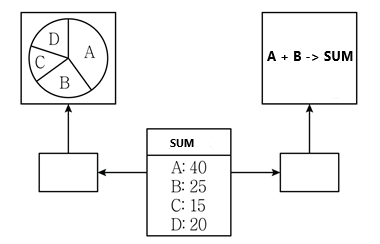

```
시스템에 저장되는 패스워드들은 Hash 또는 암호화 알고리즘의 결과값으로 저장된다. 이때 암호공격을 막기 위해 똑같은 패스워드들이 다른 암호 값으로 저장되도록 추가되는 임의의 문자열인 (           ①         )와 해시 값을 알아보지 못하도록 하기 위해서 원문의 해시 값을 입력 값으로, 다시 그 해시 값을 다시 입력 값으로 n번 반복해서 적용하는 방법인 (       ②       )을 사용한다.
```
1.동일 패스워드를 각각 다른 암호값으로 저장 : 솔트키
2. 해시값을 입력값으로 n회 반복, 적용 : 키스트레칭

# C 포인터 &
```
#include <stdio.h>

void main(){

  char *str = "ABCDE";

  int i;

  for(i=4; i>0; i--)

    printf("%d", *(str+i));

}
```
%d 숫자로 출력됨 주의
```c
# include <stdio.h> 
int main() 
{ 
    char sTemp[16] = "Hello Sujebi"; 
    printf("%s", &sTemp[6]); 
    return 0; 
}
&는 주소 포인터 배열 6번 부터 출력됨
sTemp의 7번째( array는 0부터시작) 값인 'S' 부터 문자열의 끝까지 출력합니다.
sTemp[0]='H'     //1번째
sTemp[1]='e'     //2번째
sTemp[2]='l'      //3번째
sTemp[3]='l'     //4번쨰
sTemp[4]='o'     //5번째
sTemp[5]=' '      //6번째
sTemp[6]='S'     //7번째
sTemp[7]='u'
sTemp[8]='j'
sTemp[9]='e'
sTemp[10]='b'
sTemp[11]='i'
```
# 다음 두 릴레이션 X(A, B)와 Y(A, C)가 있을 때, SQL 문을 수행한 후 생성되는 튜플(tuple)의 갯수는?
```
(SELECT DISTINCT A FROM X) UNION ALL (SELECT A FROM Y)
```

- X표에 대해서는 DISTINCT 즉, 중복허용 안되니까 1,2,3,5 4개
- Y표에 대해서는 UNION ALL이니까 중복값 허용해서 1,1,2,4,6 5개
# C atoi
```c
#include <stdio.h>
#include <stdlib.h>  //atoi() 함수 사용하기 위한 헤더파일
int main()
{
    char str[8] = "2021";   // 문자열 "2021"
    int num = atoi(str);    // 문자열을 숫자로 변환
    printf("%d", num * 2);   // 2021(숫자) * 2 한 값을 출력
    return 0;
}
```
atoi는 문자열을 숫자로 변환하는 함수이다.
문자열 "2021"을 숫자 2021로 변환하고 2를 곱한 값을 출력한다.
# '교수' 테이블을 생성하는 SQL문에서 전공과목의 속성값을 '물리학', '심리학'으로 제한하고자 한다. ①, ②에 들어갈 SQL 구문을 쓰시오.
```sql
CREATE TABLE 교수
(교수번호 NUMBER NOT NULL,
교수명 CHAR(12),
전공과목 CHAR(15) ① (전공과목 ② ('물리학', '심리학')));
```
① CHECK
② IN
---
* (        ①       )은/는 만들어진 애플리케이션을 실행하지 않고 분석하는 도구로 대부분의 경우 소스 코드에 대한 코딩 표준, 코딩 스타일, 코드 복잡도 및 남은 결함을 발견하기 위하여 사용한다.
* 반면에 (          ②        )은/는 애플리케이션의 처리량, 응답시간, 경과시간, 자원사용률에 대해 가상의 사용자를 생성하고 테스트를 수행함으로써 성능 목표를 달성하였는지를 확인하는 테스트 자동화 도구이다.
정답  
* ① 정적 분석 도구(Static Analysis Tools)  
* ② 성능 테스트 도구(Performance Test Tools)
---
- 스크리닝 라우터(Screening Router)는 망과 망 사이에 라우터를 설치하고 라우터에 ACL을 구성하는 형태의 장비이고, 베스천 호스트(Bastion Host)는 침입 차단 소프트웨어가 설치되어 내부와 외부 네트워크 사이에서 일종의 게이트 역할을 수행하는 장비이다.
- 또한 (           ①           )은/는 2개의 네트워크 인터페이스(2개의 랜카드)를 가진 베스천 호스트를 이용한 구성으로, 논리적으로만 구분하는 베스천 호스트에 비해서 물리적으로 구분이 있으므로 더 안전한 구성 방식이다.
- 반면에 (           ②           )은/는 스크리닝 라우터 2개 사이에 하나의 서브넷(망)(=DMZ 망)을 구성하고, 서브넷에 베스천 호스트를 적용하는 구성 방식이다.
정답)  
* ① 듀얼 홈드 게이트웨이(Dual Homed Gateway)  
* ② 스크린드 서브넷 게이트웨이(Screened Subnet Gateway)
---
- (         ①        )은/는 하나의 프로세스가 CPU를 차지하고 있을 때, 우선순위가 높은 다른 프로세스가 현재 프로세스를 중단시키고 CPU를 점유하는 스케줄링 방식이다.
- (         ②        )은/는 프로세스가 도착하는 시점에 따라 그 당시 가장 작은 서비스 시간을 갖는 프로세스가 종료 시까지 자원을 점유하는 방식으로 기아 현상이 발생할 가능성이 있다.
- 또한 (         ③        )은/는 대기 중인 프로세스 중 현재 응답률(Response Ratio)이 가장 높은 것을 선택하는 방법으로 (         ②        )의 약점인 기아 현상을 보완한 기법으로 긴 작업과 짧은 작업 간의 불평등 완화한 기법이다.

정답)  
① 선점형 스케줄링(Preemptive Scheduling)  
② SJF(Shortest Job First)  
③ HRN(Highest Response Ratio Next)

---
#### 101-1. 소프트웨어 개발을 위한 전체 과정에서 발생하는 모든 항목의 변경 사항을 관리하기 위한 활동은 형상 관리라고 한다. 형상 관리 절차 중 (        ①        )은/는 소프트웨어 베이스라인의 무결성 평가와 베이스라인 변경 시 요구사항과 일치 여부 검토하는 단계이다. 또한 형상 관리를 효과적으로 수행하기 위해서는 형상관리 도구가 필요하다. 형상 관리 도구 중 (        ②        )은/는 CVS와 달리 소스 파일의 수정을 한 사람만으로 제한하여 다수의 사람이 파일의 수정을 동시에 할 수 없도록 파일 잠금 방식으로 형상을 관리하는 도구이다. 괄호(       ) 안에 들어갈 가장 정확한 용어를 쓰시오.


정답)

```① 형상 감사```

```② RCS (Revision Control System)```

#####  인공지능 기술과 클라우드 기술

* (           ①           )은/는 구글의 구글 브레인 팀이 제작하여 공개한 기계 학습(Machine Learning)을 위한 오픈소스 소프트웨어 라이브러리이다.
* (           ②          )은/는 국내 IT 서비스 경쟁력 강화를 목표로 개발되었으며 인프라 제어 및 관리 환경, 실행 환경, 개발 환경, 서비스 환경, 운영 환경으로 구성되어 있는 NIA 주도로 개발된 개방형 클라우드 컴퓨팅 플랫폼이다.

```① 텐서플로(TensorFlow)```

```② 파스타(PaaS-TA)```

#### 117. 데이터 링크 계층에서 오류가 발생하면 수신 측은 오류의 발생을 송신 측에 알리고, 송신 측은 오류가 발생한 프레임을 재전송하는 방식으로 오류 검출 후 재전송하는 방식은 무엇인가?

정답) 자동반복 요청(```ARQ```; Automatic Repeat reQuest) 방식

해설) 2021년 필기 기출문제 변형 문제

* ARQ  개념과 종류는 알아두세요.

* 자동반복 요청(ARQ; Automatic Repeat reQuest) 방식의 종류에는 Stop-and-wait ARQ 방식, Go-back-N ARQ 방식, Selective repeat ARQ 방식이 있다. 

#### 116. A 기업은 ISMS-P 심사에 따른 정보 보안 문제점을 통보받고, 아래와 같이 분야별 정보보안 개선 대책을 수립중이다. 아래 괄호(      ) 안에 들어갈 용어를 쓰시오.

* 가. (문제점) A 기업의 주요 시스템에 대한 기존 접근 통제 방식의 개선 필요  
- -  → (개선 대책) 시스템 정보의 허용등급을 기준으로 사용자가 갖는 접근 허가 권한에 근거하여 시스템에 대한 접근을 제한하는 방법인 (         ①        ) 방식으로 개선 예정
*  나. (문제점) 현재 중요 개인정보를 저장하고 있는 3DES 방식의 데이터 베이스 암호화 알고리즘에 대한 개선 필요
- -  → (개선 대책) 미국 표준 기술 연구소(NIST)에서 발표한 블록 암호화 방식으로 블록의 크기가 128bit이며, 키 길이에 따라 128bit, 192bit, 256bit로 분류되는 (         ②        ) 알고리즘으로 개선 예정
* 다. (문제점) A 기업 내 사무실 내에서 유지보수 직원의 노트북이 관리자 승인없이 구내 네트워크에 접속되는 문제점 개선 필요
- - → (개선 대책) 단말기가 내부 네트워크에 접속을 시도할 때 이를 제어하고 통제하는 기능을 제공하는 솔루션인 (         ③        ) 장비 도입 예정


```① 강제적 접근 통제(MAC; Mandatory Access Control)```

```② AES(Advanced Encryption Standard)```

```③ 네트워크 접근 제어(NAC; Network Access Control)```

## 115. 아래는 소프트웨어 아키텍처 4+1 관점(view)에 대한 설명이다. 괄호(   ) 안에 들어갈 용어를 쓰시오.

* (             ①               )은/는 시스템의 기능적인 요구사항이 어떻게 제공되는지 설명해주는 뷰로 설계자, 개발자 관점이다.
* ```유스케이스 뷰(Usecase View)```는 유스케이스 또는 아키텍처를 도출하고 설계하며 다른 뷰를 검증하는 데 사용되는 뷰이고, 외부 행위자에 의해 인식되는 시스템의 기능 요구사항을 보여주는 데 초점을 둔다.
*  ```구현 뷰(Implementation View)```는 개발 환경 안에서 정적인 소프트웨어 모듈의 구성을 보여주는 뷰이고, 
* (             ②               )은/는 컴포넌트가 물리적인 아키텍처에 어떻게 배치되는가를 매핑해서 보여주는 뷰로 물리적 시스템을 구성하고 있는 각 부분들의 분산 형태와 설치에 초점을 둔다.

정답) 

```text
① 논리 뷰(Logical View)
② 배포 뷰(=배치 뷰)(Deployment View)
```

## 14. 아래는 관찰대상(SUM)의 데이터(A ~ D)에 변화가 발생하면 이 변화를 탐지하여 사용자에게 자동으로 내용이 갱신되고 디스플레이하는 프로그램이다. 이 프로그램을 개발하기 위해서 적용할 수 있는 디자인 패턴 유형을 영문 Full-name으로 쓰시오.





정답) Observer (Pattern)

해설) 2022 정보처리기사 실기책 1-26페이지

※ Observer (Pattern)은 한 객체의 상태가 바뀌면 그 객체에 의존하는 다른 객체들에 연락이 가고 자동으로 내용이 갱신되는 방법으로 일대 다의 의존성을 가지며 상호작용하는 객체 사이에서는 가능하면 느슨하게 결합하는 디자인 패턴이다.

## 서버 프로그램 구현 - 120

- 모듈의 (         ①        )은 결합도와 응집도에 의해 측정되며, (         ①        )을 높이려면 모듈의 결합도는 약하게(낮게), 응집도는 강하게(높게), 모듈의 크기는 작게 만들어야 한다.

- 또한 모듈의 결합도가 가장 낮은 유형은  (         ②        ) 결합도이고, 모듈의 응집도가 가장 높은 유형은 (         ③        ) 응집도이다.

정답)

① 독립성
② 자료
③ 기능적


### 119. 아래는 데이터 링크 계층의 스위치 장비에서 사용되는 기술 및 프로토콜이다. 괄호(      ) 안에 들어갈 용어를 쓰시오.

- (          ①          )은/는 물리적 배치와 상관없이 논리적으로 LAN을 구성하여 Broadcast Domain을 구분할 수 있게 해주는 기술로 접속된 장비들의 성능향상 및 보안성 증대 효과가 있다.


- (          ②         )은/는 2개 이상의 스위치가 여러 경로로 연결될 때, 무한 루프 현상을 막기 위해서 우선순위 따라 1개의 경로로만 통신하도록 하는 프로토콜이다.


정답)


① VLAN(Virtual Local Area Network)
② STP(Spanning Tree Protocol)

## 118. 아래는 운영체제의 가상기억장치 관리에 대한 설명이다. 괄호(       ) 안에 들어갈 용어를 쓰시오.

- (           ①           )은/는 프로세스가 기억장치 내의 모든 정보를 균일하게 참조하는 것이 아니라 특정 부분만을 집중적으로 참조하는 성질이다.

- (           ①          )을/를 이용하여 프로세스의 처리 시간보다 페이지 교체시간이 더 많아지는 현상인 스레싱(Thrashing)을 줄일 수 있다.

- (           ①          )의 성질을 이용한 (           ②          )은/는 각 프로세스가 많이 참조하는 페이지들의 집합을 주기억장치 공간에 계속 상주하게 하여 빈번한 페이지 교체 현상을 줄이고자 하는 기법이다.


정답)


① 지역성(Locality, 구역성)


② 워킹 세트(Working Set)

