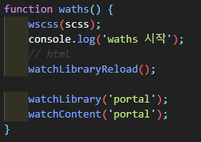

# 프로젝트 설정

## autoprefixer 설정

* 파일 = .browserslistrc
* 위치 : 프로젝트 루트('/static' 폴더가 있는곳)
* 파일내용

```text
# Browsers that we support

last 2 version
```

## gulp 설정

* 파일 : gulpfile.js
* 위치 : 프로젝트 루트
* scss, project 설정  

* 실시간 감시 폴더 설정  

* ```watchLibrary(프로젝트이름)``` 프로젝트 lib 폴더 감시
* ```watchContent(프로젝트이름)``` 프로젝트 content 폴더 감시
* ```static\guide\프로젝트\lib``` = 프로그램 페이지
* ```static\guide\프로젝트\content``` = 콘텐츠 페이지

## 패키지 파일

* 파일 : package.json
* 위치 : 프로젝트 루트 or 드라이브 루트(c:\ or d:\)
* 패키지 설치 파일은 전역으로 설치되거나 프로젝트 하위로 설치 가능함.
